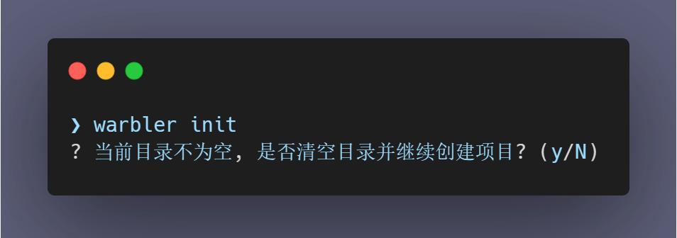
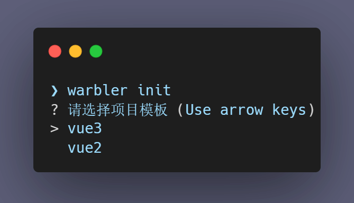

# 创建一个项目

## init

运行以下命令来创建一个新项目：

```shell
warbler init [options]
```

如果你执行命令所在的目录不为空的话，你会收到这样的提示：



输入 `y`，继续创建，输入 `N`，则退出程序，结束创建

::: warning
输入 y 后，脚手架会清空执行目录下所有的文件，并且不可恢复，请确认目录中的内容是否必要。
:::

如果你选择清空目录，或者目录本身为空，你会被提示选取一个模板：



当然，模板可能不止图中的几个，你也可以选择 [添加自定义模板](url)

选择完模板以后等待安装完成即可，如果携带了 `--install`，`--serve` 参数，你还需要等待脚手架为你安装依赖，启动服务

## options

运行以下命令来查看支持的参数：

```shell
warbler init -h
```

你会得到以下的结果：

```shell
Usage: warbler init [options]

通过选择模板, 您可以快速的初始化一个项目

Options:
  -f, --force    是否强制初始化项目(会清空所有文件) (default: false)
  -i, --install  是否在创建完成后自动安装依赖 (default: false)
  -s, --serve    是否在安装依赖后自动启动服务 (default: false)
  -h, --help     查看帮助文档
```

### --force

是否强制初始化项目，使用该参数后，如果执行目录下有文件，则不进行询问，直接强制清空。

::: warning
使用该参数会清空执行目录下所有的文件，并且不可恢复，请确认目录中的内容是否必要，再使用该参数。
:::

```shell
# 你可以这样使用该参数
warbler init --force
# 也可以使用它的简写模式
warbler init -f
```

### --install

是否在创建完成后自动安装依赖，使用该参数，在模板完成安装后会自动执行 `npm install` 来安装项目所需要的依赖

```shell
# 你可以这样使用该参数
warbler init --install
# 也可以使用它的简写模式
warbler init -i
```

### --serve

是否在安装依赖后自动启动服务，使用该参数，在依赖完成安装后，会自动执行 `npm run serve` 来启动项目

::: warning
使用该参数要满足两个前置条件，否则会抛出错误：

- 需要携带 --install 参数
- 项目的启动命令必须是 serve
  :::

```shell
# 你可以这样使用该参数
warbler init --install --serve
# 也可以使用它的简写模式
warbler init -i -s
```

### --help

查看 `init` 命令的帮助文档，正如你上面看到的那样

```shell
# 你可以这样使用该参数
warbler init --help
# 也可以使用它的简写模式
warbler init -h
```
